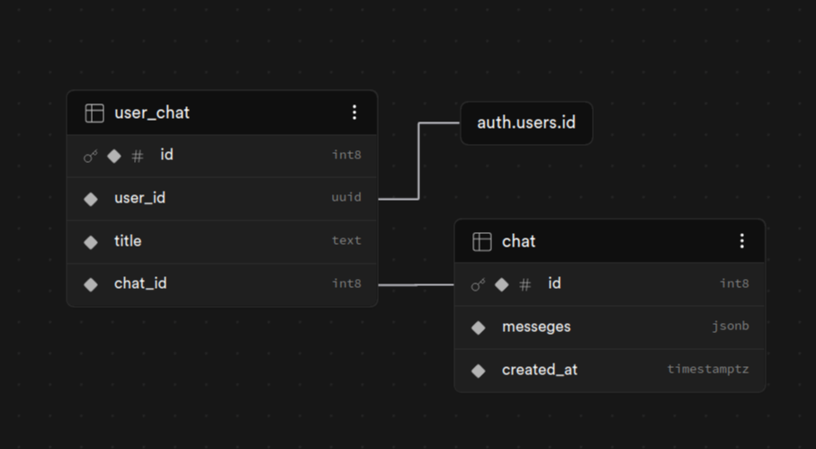

# Задание № 3. Мини-продукт с LLM-аналитикой

## Запуск проекта

Перед запуском приложения необходимо выполнить:
```sh
python -m venv .venv
source .venv/bin/activate
pip install -r requirements.txt
```

Запуск самого приложения выполняется через команду:
```sh
streamlit run app.py
```

## Описание проекта

Проект представляет из себя [веб-сайт](https://llmchatbot-x5mguujdi8sg6xcguzxmkt.streamlit.app/), предназначенный для анализа данных, сохранённых в формате CSV, с дополнительной инструкцией от пользователя. LLM способна анализировать с датасетом, причём для выдачи ответа создаётся поручение написания и выполнения кода на Python, для подтверждения значений. Проект выполнен в стиле классических чатов с нейросетью (по крайней мере была попытка на это)

Пользовательская карта: <br>
1) Страница авторизации:
    + На этой странице пользователя ждут поля ввода электронной почты, пароля, а также кнопки входа и регистрации
    + Почту можно вводить любую, главное, чтобы соответствовало формату e-mail, проверку истинности вводить не планируется
    + На ввод пароля также есть ограничения для защиты от инъекций
    + При создании аккаунта и после нажатия кнопки регистрации происходит автоматических переход на основную страницу и сохранение access и refresh токенов автоматически в куки, что позволяет не вводить почту и пароль при каждом входе
2) Основная страница:
    + Боковая панель:
        + Если у пользователя число чатов больше одного, то в боковой панели будет отображаться список чатов пользователя для удобной навигации
        + Кнопка выхода совершает переход на страницу авторизации и удаляет куки с токенами
        + Кнопка "Новый чат", как ясно из названия, создаёт новый чат при условии, что у пользователя нет какого-либо уже созданного пустого чата
    + Чат:
        + В верхней части чата история запрос-ответов:
            +  Запрос пользователя состоит из 3 частей:
                + Название файла, которое было отправлено для анализа
                + Превью из первых 5 строк CSV-файла, которое было отправлено
                + Текст запроса пользователя для анализа переданного датасета
            + Запрос LLM может состоять из 1 или 2 частей. В случае, если в ходе анализа запроса модель нарисовала график, то в начале ответа будет отображён нарисованный график. Если график не присутствует, то в ответе LLM всегда будет анализ запроса (либо сообщение об ошибке, простите, тут уж я ничего сделать не смог, я не могу контролировать каждый возможный запрос пользователя)
            + В случае, если чат изначально был пустой, то после отправки пользователем первого запроса перед генерацией ответа LLM сначала сгенерирует название для этого чата, после чего у чата будет обновлено название
        + В нижней части чата расположены формы для пользовательского ввода:
            + Изначально пользователю представлена лишь форма для передачи CSV-файла
            + После передачи закрепления файла, на основе которого необходимо строить анализ и график, всплывает форма для ввода текстового запроса, в котором пользователь может написать инструкцию, который должен привести к ожидаемому результату
        
На данный момент это все основные фичи данного проекта, кто знает, может, в будущем я буду дорабатывать этот проект

## Применённые инструменты

### Streamlit

Для создания самого сайта и его визуальной составляющей была использована библиотека Streamlit. По умолчанию этот инструмент предназначен для того, чтобы аналитик, data scientist и другие схожие специалисты могли представить свою работу в более удобный и читаемый для людей, далёких от этой сферы, ведь далеко не каждый способен работать кодом или юпитер ноутбуком, а в презентациях нет возможности также подробно и наглядно изучать графики, как в matplotlib, plotly и тд. Также очень важной возможностью является возможность бесплатно и очень просто задеплоить сайт через Streamlit Community Cloud

Я буквально недавно познакомился с этим инструментом, мне она показалась очень интересной, поэтому решил попробовать сделать сайт на нём, ну и меня очень привлекли встроенные инструменты для вывода Markdown, таблиц pandas и графиков. Вердикт мой таков: Для своих изначальных задач в виде удобного представления для проведённых анализов Streamlit подходит идеально, но если нужно сделать что-то более сложное и серьёзное, то лучше выберите более привычные и классические для разработки веб-сайтов инструменты, оно того не стоит

### Supabase

В качестве сервиса для работы с базой данных был выбран Supabase $-$ это открытый проект для удобной работы с PostgreSQL базой банных, включающая в себя также и сервис аутентификации, а также сервер, который обеспечивает его работу, из-за чего не нужно было как-то дополнительно думать над деплоем базы данных.

Для данного проекта применяется 3 таблицы:



#### Таблица `users`:

| Поле | Тип | Описание |
| --- | --- | --- |
| id | uuid | Уникальный идентификатор пользователя |
| email | char | Электронная почта пользователя |
| password | char | Хэшированный пароль пользователя |
| created_at | timestamp | Дата создания аккаунта |

#### Таблица `chat`:

| Поле | Тип | Описание |
| --- | --- | --- |
| id | bigint | Уникальный идентификатор чата |
| messages | jsonb | JSON, содержащий историю запросов и ответов в чате |
| created_at | timestamp | Дата создания чата |

SQL схема:
```sql
create table public.chat (
  id bigint generated by default as identity not null,
  messeges jsonb not null default '{}'::jsonb,
  created_at timestamp with time zone not null default now(),
  constraint chat_pkey primary key (id)
) TABLESPACE pg_default;
```

#### Таблица `user_chat`:

| Поле | Тип | Описание |
| --- | --- | --- |
| id | uuid | Уникальный идентификатор |
| user_id | uuid | Уникальный идентификатор пользователя |
| chat_id | bigint | Уникальный идентификатор чата |
| title | text | Заголовок чата |

SQL схема:
```sql
create table public.user_chat (
  id bigint generated by default as identity not null,
  user_id uuid not null,
  title text not null default 'Новый чат'::text,
  chat_id bigint not null,
  constraint UserChats_pkey primary key (id),
  constraint UserChats_chat_id_fkey foreign KEY (chat_id) references chat (id),
  constraint UserChats_user_id_fkey foreign KEY (user_id) references auth.users (id) on delete CASCADE
) TABLESPACE pg_default;
```

### Open Router

Open Router представляет из себя сервис для подключения ИИ-агента и работы с ним

В качестве LLM для выполнения работы была выбрана модель `openai/gpt-oss-120b:free`, данная модель имеет следующие характеристики: <br>
+ **Число параметров**: 120 миллиардов
+ **Контекстное окно**: 131.1 тысяч токенов
+ **Максимальный выход**: 131.1 тысяч токенов
+ **Скорость генерации**: 22 токена в секунду
+ **Время отклика**: 0.86 секунд
+ **Цена**: бесплатно

### LangChain

LangChain является популярным фреймворком для работы с LLM. В проекте он применяется для передачи модели датафрейма и выполнения Python кода, а также для защиты от потенциально опасного кода.