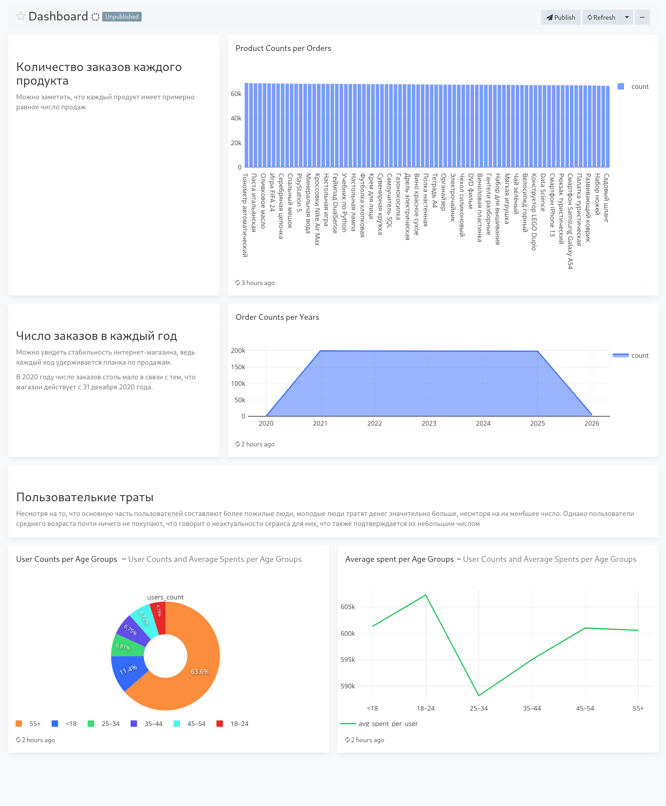

# Введение

Этот проект является учебным, необходим он был для ознакомления с основами:</br> 
+ языка **SQL**;
+ контейнеризации **Docker Compose**;
+ анализа и визуализации через **Redash**.
  
В проекте были реализованы:
+ **Генерация данных** для последующего заполнения ими базы данных PostgreSQL;
+ **Запуск Docker** для автоматического выполнения всех действий для создания БД и подключения к Redash.

# Структура проекта

Проект имеет вид:
```sh
DataAnalisys
├── docker-compose.yml
├── generator
│   ├── categories
│   │   ├── categories.py
│   │   └── __init__.py
│   ├── cities
│   │   ├── cities.py
│   │   ├── city.csv
│   │   └── __init__.py
│   ├── Dockerfile
│   ├── __init__.py
│   ├── main.py
│   ├── orders
│   │   ├── __init__.py
│   │   └── orders.py
│   ├── products
│   │   ├── __init__.py
│   │   └── products.py
│   ├── requirements.txt
│   └── users
│       ├── __init__.py
│       └── users.py
├── init.sql
└── run.sh
```

## docker-compose.yml

В этом файле описана вся инфраструктура проекта, которая поднимается через Docker Compose.

В проекте используются следующие сервисы:</br>
+ **postgres** $-$ основная база данных проекта;
+ **generator** $-$ небольшой Python-код, призванный генерировать\хранить данные и заполнить ими базу данных;
+ **redash_postgres** $-$ отдельная база данных, используемая Redash для хранения;
+ **redis** $-$ нереляционная база данных, применяемая Redash для передачи задач с сервера в worker;
+ **redash_server** $-$ веб-интерфейс и API Redash;
+ **redash_worker** $-$ исполнитель SQL запросов в Redash.

## generator

Данная директория содержит в себе Python-код, который заполняет базу данных.

## init.sql

Здесь хранится SQL-запрос для создания базы данных проекта. В качестве идеи для проекта был взят Интернет-магазин.

База данных имеет следующие таблицы:</br>
+ **cities** $-$ таблица со списком городов России:

| Column | Type | Nullable | Default | Key |
|--------|------|----------|---------|-----|
| id | serial | not null | nextval('orders_id_seq'::regclass) | primary key |
| name | varchar(255) | not null | | |

+ **categories** $-$ таблица со списком категорий товаров:

| Column | Type | Nullable | Default | Key |
|--------|------|----------|---------|-----|
| id | serial | not null | nextval('orders_id_seq'::regclass) | primary key |
| name | varchar(255) | not null | | |

+ **products** $-$ таблица со списком товаров:

| Column | Type | Nullable | Default | Key |
|--------|------|----------|---------|-----|
| id | serial | not null | nextval('orders_id_seq'::regclass) | primary key |
| name | varchar(100) | not null | | |
| description | text | | | |
| price | numeric(10,2) | not null | | |
| category_id | int | not null | | foreign key: categories.id |

+ **users** $-$ таблица с случайными пользователями:

| Column | Type | Nullable | Default | Key |
|--------|------|----------|---------|-----|
| id | serial | not null | nextval('orders_id_seq'::regclass) | primary key |
| login | varchar(100) | not null | | |
| email | varchar(255) | not null | | |
| age | int | | | |

+ **orders** $-$ таблица с случайными заказами:

| Column | Type | Nullable | Default | Key |
|--------|------|----------|---------|-----|
| id | serial | not null | nextval('orders_id_seq'::regclass) | primary key |
| city_id | int | not null | | foreign key: cities.id |
| product_id | int | not null | | foreign key: products.id |
| user_id | int | not null | | foreign key: users.id |
| quantity | int | | 1 | |
| created_at | timestamp | not null | | |

## run.sh

Это скрипт для запуска Docker.

# Запуск

Для запуска проекта необходимо выполнить:

```sh
sh run.sh
```

Чтобы подключиться к Redash, необходимо перейти в http://localhost:5000 и зарегистрироваться, введя свои данные.

# Redash

## SQL-запросы

+ **Product Counts per Orders** $-$ получение информации о числе покупок каждого товара:

```sql
SELECT products.name,
       COALESCE(SUM(orders.quantity), 0) AS COUNT
FROM products
LEFT JOIN orders ON orders.product_id = products.id
GROUP BY products.name
ORDER BY COUNT DESC;
```

+ **Order Counts per Years** $-$ получение информации о количестве заказов зв каждый год:

```sql
SELECT EXTRACT(YEAR
               FROM orders.created_at) AS YEAR,
       count(*) AS COUNT
FROM orders
GROUP BY YEAR
ORDER BY YEAR;
```

+ **User Counts and Average Spents per Age Groups** $-$ получение информации о числе пользователей и их средней общей суммы трат за всё время по возрастным группам:

```sql
WITH user_spend AS
  (SELECT users.id,
          users.age,
          SUM(orders.quantity * products.price) AS total_spent
   FROM users
   JOIN orders ON orders.user_id = users.id
   JOIN products ON products.id = orders.product_id
   GROUP BY users.id,
            users.age),
     age_groups AS
  (SELECT CASE
              WHEN age < 18 THEN '<18'
              WHEN age BETWEEN 18 AND 24 THEN '18–24'
              WHEN age BETWEEN 25 AND 34 THEN '25–34'
              WHEN age BETWEEN 35 AND 44 THEN '35–44'
              WHEN age BETWEEN 45 AND 54 THEN '45–54'
              ELSE '55+'
          END AS age_group,
          total_spent
   FROM user_spend)
SELECT age_group,
       COUNT(*) AS users_count,
       AVG(total_spent) AS avg_spent_per_user
FROM age_groups
GROUP BY age_group
ORDER BY age_group;
```

## Dashboard

